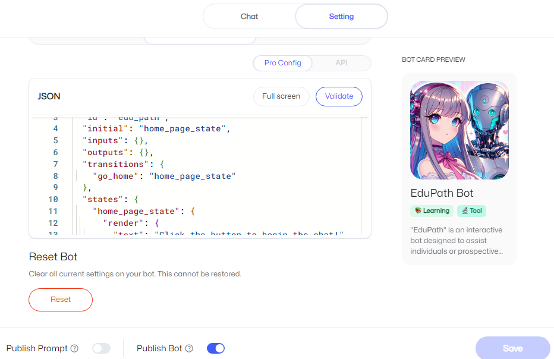
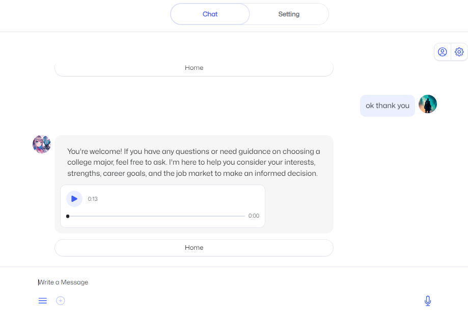

# edupath_myshell_ai

## MyShell is building an AI consumer layer that connects users, creators, and open-source AI researchers

"EduPath" is an interactive bot designed to assist individuals or prospective students in choosing a college major that aligns with their passions, interests, and strengths. By engaging with the bot, users can explore various fields of study, discover potential career paths, and receive personalized recommendations based on their preferences. Whether you're unsure about which direction to take or seeking guidance to enhance your knowledge in a specific area.

**Join & Create your own AI Bot** &nbsp;  [MyShell](https://app.myshell.ai/invite/bbf1c3)